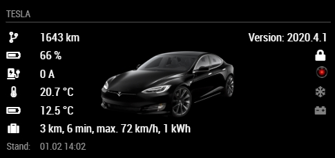
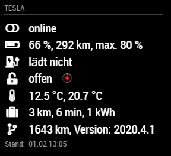

# Teslalogger

Module for [MagicMirror](https://github.com/MichMich/MagicMirror/) showing data from the [Teslalogger](https://github.com/bassmaster187/TeslaLogger) subscribed to via MQTT.

This module is based on [MMM-MQTT](https://github.com/ottopaulsen/MMM-MQTT) and would not have been possible without the work of [Otto Paulsen](https://github.com/ottopaulsen). Thanks a lot for your work!

## Screenshots

view "image" with your Tesla image



view "groupedLines"



view "lines"


## Installation

Go to `MagicMirror/modules` and write

    git clone https://github.com/spitzlbergerj/MMM-Teslalogger
    cd MMM-Teslalogger
    npm install


## Configuration

Here is an example configuration with description. Put it in the `MagicMirror/config/config.js` file:

```javascript
{
    module: 'MMM-TeslaLogger',
    position: 'top_right',
    header: 'Tesla',
    config: {
        mqttServerAddress: '000.000.000.000',  // Server address or IP address
        mqttServerPort: '1883',          // Port number if other than default
        // mqttServerUser: '',          // Leave out for no user
        // mqttServerPassword: '',  // Leave out for no password
        logging: true,
		localeStr: 'de-DE',
        maxAgeSeconds: 36000,    // Reduce intensity if values are older
		style: "lines",

        displayState: true,
        displayOdometer: true,
        displayOutside_temp: true,
        displayBattery_level: true,
        displayCharger_actual_current: true,
        displayInside_temperature: true,
        displaySentry_mode: true,
    }
},
```

## Configuration options

<table width="100%">
  <thead>
    <tr>
      <th>Option</th>
      <th width="100%">Description</th>
    </tr>
  <thead>
  <tbody>
    <tr>
      <td><code>logging</code></td>
      <td>Switch on logging
      <br><b>Possible values:</b> <code>"true"</code> - <code>"false"</code>
      <br><b>Default value:</b> <code>"false"</code>
      </td>
    </tr>
    <tr>
      <td><code>style</code></td>
      <td>The display style for the Tesla data
	<br>For a line-by-line display of data from TeslaLogger's MQTT messages, set the value to "lines". Use the display* variables to specify which values are displayed.<br>
	<br>For a grouped line by line display of TeslaLogger data, set the value to "groupedLines".  The display* variables allow you to control which values are displayed. However, not all values can be hidden.<br>
         <br>For a display with a photo of your Tesla, set the value to "image".  The TeslaLogger values are grouped around the photo. The display* variables have no effect on the display.<br>
      <br><b>Possible values:</b> <code>"lines"</code> - <code>"groupedLines"</code> - <code>"image"</code>
      <br><b>Default value:</b> <code>"lines"</code>
      </td>
    </tr>
    <tr>
      <td><code>maxAgeSeconds</code></td>
      <td>The intensity of the letters is reduced after the specified seconds have elapsed. Older data is therefore displayed less brightly.
	    <br><b>Default value:</b> <code>36000</code> = 10 hours
      </td>
    </tr>
    <tr>
      <td><code>localeStr</code></td>
      <td>String for country-specific formatting of numbers.
        <br><b>Possible values:</b> see <a href="https://tools.ietf.org/html/rfc5646">Tags for Identifying Languages</a>
		<br><b>Example values:</b> <code>de-DE</code> - <code>en-US</code>
        <br><b>Default value:</b> <code>"de-DE"</code>
      </td>
    </tr>
    <tr>
      <td><code>imageURL</code></td>
      <td>URL to the image file for the style "image".
	    <br><b>Default value:</b> <code>'modules/MMM-TeslaLogger/img/teslaModelSBlack.png'</code>
      </td>
    </tr>
    <tr>
      <td><code>imageSize</code></td>
      <td>The image file in the view "image" is displayed centered. This value controls how large the image file is displayed and how much space remains for the TeslaLogger data displayed.
	    <br><b>Default value:</b> <code>"70%"</code>
      </td>
    </tr>
    <tr>
      <td><code>sentryImageURL</code></td>
      <td>URL to the image file that will be displayed if sentry mode is enabled.
	    <br><b>Default value:</b> <code>'modules/MMM-TeslaLogger/img/HAL9000.png'</code>
      </td>
    </tr>
    <tr>
      <td><code>style</code></td>
      <td>The style of output.
        <br><b>Possible values:</b> <code>lines</code> - <code>table</code>
        <br><b>Default value:</b> <code>lines</code>
      </td>
    </tr>
    <tr>
      <td><code>tempUnit</code></td>
      <td>The unit of temperature.
        <br><b>Possible values:</b> <code>°C</code> - <code>°F</code> - <code>K</code>
        <br><b>Default value:</b> <code>°C</code>
      </td>
    </tr>
    <tr>
      <td><code>humUnit</code></td>
      <td>The unit of humidity.
        <br><b>Possible values:</b> <code>%</code> - <code>g/m³</code>
        <br><b>Default value:</b> <code>%</code>
      </td>
    </tr>
    <tr>
      <td><code>shutterUnit</code></td>
      <td>The unit of the shutter actuator.
        <br><b>Possible values:</b> <code>%</code> - <code>pc</code>
        <br><b>Default value:</b> <code>%</code>
      </td>
    </tr>
    <tr>
      <td><code>numberUnit</code></td>
      <td>The unit of a numeric value.
	<br>This value is only used for 'other' and 'sysvar_number' types.
        <br><b>Possible values:</b> any string value for example <code>"km/h"</code>
        <br><b>Default value:</b> <code>" "</code>
      </td>
    </tr>
    <tr>
      <td><code>tableShowTextRow</code></td>
      <td>Toggles whether the row with the names of the devices is displayed in the table view.
	<br>This value is only used in table view.
      <br><b>Possible values:</b> <code>"true"</code> - <code>"false"</code>
      <br><b>Default value:</b> <code>"true"</code>
      </td>
    </tr>
    <tr>
      <td><code>tableShowValueRow</code></td>
      <td>Toggles whether the row with the values of the devices is displayed in the table view.
	<br>This value is only used in table view.
      <br><b>Possible values:</b> <code>"true"</code> - <code>"false"</code>
      <br><b>Default value:</b> <code>"true"</code>
      </td>
    </tr>
    <tr>
      <td><code>locale</code></td>
      <td>String for country-specific formatting of numbers.
        <br><b>Possible values:</b> see <a href="https://tools.ietf.org/html/rfc5646">Tags for Identifying Languages</a>
		<br><b>Example values:</b> <code>de-DE</code> - <code>en-US</code>
        <br><b>Default value:</b> <code>config.language(default:en)</code>
      </td>
    </tr>
    <tr>
      <td><code>datapoints</code></td>
      <td>An array of datapoint objects.
		<br>Each datapoint object represents one value/state of a device.
		<br><b>Example value:</b>
		<br><code>[{
		<br>id: 1234,
		<br>name: "front door",
		<br>type: window_warn_open,
		<br>},{
		<br>id: 4711,
		<br>name: "humidity laundry room",
		<br>type: "hum_warn_high",
		<br>threshold: "60"
		<br>}]</code>
      </td>
    </tr>
    <tr>
      <td><code>animationSpeed</code></td>
      <td>Speed of the update animation. (Milliseconds)<br>
        <br><b>Possible values:</b><code>0</code> - <code>5000</code>
        <br><b>Default value:</b> <code>1000</code> (1 seconds)
      </td>
    </tr>
  </tbody>
</table>

## Further information
* [HomeMatic](https://www.homematic.com/) - HomeMatic website
* [XML-API](https://github.com/hobbyquaker/XML-API) - XML-Api for HomeMatic CCU
* [Homematic-Scripts](https://github.com/spitzlbergerj/homematic-scripts) - Scripts for your HomeMatic installation by [@spitzlbergerj](https://github.com/spitzlbergerj).
* [MMM-Homematic-Thermostats](https://github.com/spitzlbergerj/MMM-Homematic-Thermostats) - A very good Magic Mirror Module for Homematic radiator thermostats. <br/><br/>


