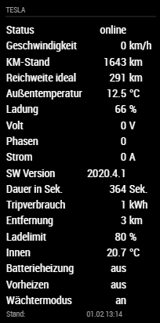

# Teslalogger

Module for [MagicMirror](https://github.com/MichMich/MagicMirror/) showing data from the [Teslalogger](https://github.com/bassmaster187/TeslaLogger) or from [TeslaMate](https://github.com/adriankumpf/teslamate) or both subscribed to via MQTT.

This module is based on [MMM-MQTT](https://github.com/ottopaulsen/MMM-MQTT) and would not have been possible without the work of [Otto Paulsen](https://github.com/ottopaulsen). Thanks a lot for your work!

## Screenshots

view "image" with your Tesla image


view "groupedLines"


view "lines"




## Installation

Go to `MagicMirror/modules` and write

    git clone https://github.com/spitzlbergerj/MMM-Teslalogger
    cd MMM-Teslalogger
    npm install


## Configuration

Here is an example configuration with description. Put it in the `MagicMirror/config/config.js` file:

```javascript
{
    module: 'MMM-TeslaLogger',
    position: 'top_right',
    header: 'Tesla',
    config: {
        mqttServerAddress: '000.000.000.000',
        mqttServerPort: '1883',
        // mqttServerUser: '',
        // mqttServerPassword: '',
	mqttTopics: [
		"Tesla",
		"teslamate/cars/1/+",
	],
        logging: true,
		localeStr: 'de-DE',
        maxAgeSeconds: 36000,
		style: "lines",

        displayState: true,
        displayOdometer: true,
        displayOutside_temp: true,
        displayBattery_level: true,
        displayCharger_actual_current: true,
        displayInside_temperature: true,
        displaySentry_mode: true,
    }
},
```

## Configuration options

<table width="100%">
  <thead>
    <tr>
      <th>Option</th>
      <th width="100%">Description</th>
    </tr>
  <thead>
  <tbody>
    <tr>
      <td><code>mqttServerAddress</code></td>
      <td>IP address of the MQTT Broker
      </td>
    </tr>
    <tr>
      <td><code>mqttServerUser</code></td>
      <td>Port of MQTT Broker
      </td>
    </tr>
    <tr>
      <td><code>mqttServerUser</code></td>
      <td>User to access the MQTT Broker (optional)
      </td>
    </tr>
    <tr>
      <td><code>mqttServerPassword</code></td>
      <td>Password of user to access the MQTT Broker (optional)
      </td>
    </tr>
    <tr>
      <td><code>mqttTopics</code></td>
      <td>Topics for the MQTT Broker (optional)
      <br><b>Possible values:</b> <code>["Tesla",]</code> - <code>["teslamate/cars/1/+",]</code> - <code>["Tesla","teslamate/cars/1/+",]</code>
      <br><b>Default value:</b> <code>["Tesla","teslamate/cars/1/+",]</code>      </td>
    </tr>
    <tr>
      <td><code>style</code></td>
      <td>The display style for the Tesla data
	<br>For a line-by-line display of data from TeslaLogger's MQTT messages, set the value to "lines". Use the display* variables to specify which values are displayed.<br>
	<br>For a grouped line by line display of TeslaLogger data, set the value to "groupedLines".  The display* variables allow you to control which values are displayed. However, not all values can be hidden.<br>
         <br>For a display with a photo of your Tesla, set the value to "image".  The TeslaLogger values are grouped around the photo. The display* variables have no effect on the display.<br>
      <br><b>Possible values:</b> <code>"lines"</code> - <code>"groupedLines"</code> - <code>"image"</code>
      <br><b>Default value:</b> <code>"lines"</code>
      </td>
    </tr>
    <tr>
      <td><code>maxAgeSeconds</code></td>
      <td>The intensity of the letters is reduced after the specified seconds have elapsed. Older data is therefore displayed less brightly.
	    <br><b>Default value:</b> <code>36000</code> = 10 hours
      </td>
    </tr>
    <tr>
      <td><code>localeStr</code></td>
      <td>String for country-specific formatting of numbers.
        <br><b>Possible values:</b> see <a href="https://tools.ietf.org/html/rfc5646">Tags for Identifying Languages</a>
		<br><b>Example values:</b> <code>de-DE</code> - <code>en-US</code>
        <br><b>Default value:</b> <code>"de-DE"</code>
      </td>
    </tr>
    <tr>
      <td><code>logging</code></td>
      <td>Switch on logging
      <br><b>Possible values:</b> <code>"true"</code> - <code>"false"</code>
      <br><b>Default value:</b> <code>"false"</code>
      </td>
    </tr>
    <tr>
      <td><code>imageURL</code></td>
      <td>URL to the image file for the style "image".
	    <br><b>Default value:</b> <code>'modules/MMM-TeslaLogger/img/teslaModelSBlack.png'</code>
      </td>
    </tr>
    <tr>
      <td><code>imageSize</code></td>
      <td>The image file in the view "image" is displayed centered. This value controls how large the image file is displayed and how much space remains for the TeslaLogger data displayed.
	    <br><b>Default value:</b> <code>"70%"</code>
      </td>
    </tr>
    <tr>
      <td><code>sentryImageURL</code></td>
      <td>URL to the image file that will be displayed if sentry mode is enabled.
	    <br><b>Default value:</b> <code>'modules/MMM-TeslaLogger/img/HAL9000.png'</code>
      </td>
    </tr>
    <tr>
      <td><code>display**</code><br><code>unit**</code></td>
      <td>If the corresponding data field should be displayed in the <code>style</code> <code>lines</code> or <code>groupedLines</code> then set the corresponding <code>display**</code> value to true. At present, these specifications do not yet have any influence on the display in <code>style</code> <code>image</code>.
			<br>
			Use the <code>unit**</code> variables to set which unit should be displayed after the value specification
			<table width="100%">
			  <thead>
				<tr>
				  <th>display** Variable</th>
				  <th>unit** Variable</th>
				  <th width="100%">default setting for units</th>
				</tr>
			  <thead>
			  <tbody>
				<tr>
				  <td>state of the car</td>
				  <td><code>displayState</code></td>
				  <td></td>
				  <td></td>
				</tr>
				<tr>
				  <td>actual speed of the car</td>
				  <td><code>displaySpeed</code></td>
				  <td><code>unitSpeed</code></td>
				  <td><code>"km/h"</code></td>
				</tr>
				<tr>
				  <td>actual power of the car</td>
				  <td><code>displayPower</code></td>
				  <td><code>unitPower</code></td>
				  <td><code>"kW"</code>
				  </td>
				</tr>
				<tr>
				  <td>Odometer</td>
				  <td><code>displayOdometer</code></td>
				  <td><code>unitOdometer</code></td>
				  <td><code>"km"</code>
				  </td>
				</tr>
				<tr>
				  <td>Ideal range of km with actual battery level</td>
				  <td><code>displayIdeal_battery_range_km</code></td>
				  <td><code>unitIdeal_battery_range_km</code></td>
				  <td><code>"km"</code>
				  </td>
				</tr>
				<tr>
				  <td>outside temperature</td>
				  <td><code>displayOutside_temp</code></td>
				  <td><code>unitOutside_temp</code></td>
				  <td><code>"°C"</code>
				  </td>
				</tr>
				<tr>
				  <td>actual level of battery</td>
				  <td><code>displayBattery_level</code></td>
				  <td><code>unitBattery_level</code></td>
				  <td><code>"%"</code>
				  </td>
				</tr>
				<tr>
				  <td>actual voltage during charging</td>
				  <td><code>displayCharger_voltage</code></td>
				  <td><code>unitCharger_voltage</code></td>
				  <td><code>"V"</code>
				  </td>
				</tr>
				<tr>
				  <td>actual phases during charging</td>
				  <td><code>displayCharger_phases</code></td>
				  <td><code>unitCharger_phases</code></td>
				  <td><code>""</code>
				  </td>
				</tr>
				<tr>
				  <td>actual current during charging</td>
				  <td><code>displayCharger_actual_current</code></td>
				  <td><code>unitCharger_actual_current</code></td>
				  <td><code>"A"</code>
				  </td>
				</tr>
				<tr>
				  <td>energy added since start of charging</td>
				  <td><code>displayCharge_energy_added</code></td>
				  <td><code>unitCharge_energy_added</code></td>
				  <td><code>"kWh"</code>
				  </td>
				</tr>
				<tr>
				  <td>actual power during charging</td>
				  <td><code>displayCharger_power</code></td>
				  <td><code>unitCharger_power</code></td>
				  <td><code>"kW"</code>
				  </td>
				</tr>
				<tr>
				  <td>SW version of the car</td>
				  <td><code>displayCar_version</code></td>
				  <td><code>unitCar_version</code></td>
				  <td><code>""</code>
				  </td>
				</tr>
				<tr>
				  <td>time of actual/last trip start</td>
				  <td><code>displayTrip_start</code></td>
				  <td><code>unitTrip_start</code></td>
				  <td><code>"Uhr"</code>
				  </td>
				</tr>
				<tr>
				  <td>max speed during actual/last trip</td>
				  <td><code>displayTrip_max_speed</code></td>
				  <td><code>unitTrip_max_speed</code></td>
				  <td><code>"km/h"</code>
				  </td>
				</tr>
				<tr>
				  <td>max power during actual/last trip</td>
				  <td><code>displayTrip_max_power</code></td>
				  <td><code>unitTrip_max_power</code></td>
				  <td><code>"kW"</code>
				  </td>
				</tr>
				<tr>
				  <td>duration of actual/last trip in seconds</td>
				  <td><code>displayTrip_duration_sec</code></td>
				  <td><code>unitTrip_duration_sec</code></td>
				  <td><code>"Sek."</code>
				  </td>
				</tr>
				<tr>
				  <td>spended kwh since start of actual/last trip</td>
				  <td><code>displayTrip_kwh</code></td>
				  <td><code>unitTrip_kwh</code></td>
				  <td><code>"kWh"</code>
				  </td>
				</tr>
				<tr>
				  <td>average kwh during actual/last trip</td>
				  <td><code>displayTrip_avg_kwh</code></td>
				  <td><code>unitTrip_avg_kwh</code></td>
				  <td><code>"kWh"</code>
				  </td>
				</tr>
				<tr>
				  <td>distance since start of actual/last trip</td>
				  <td><code>displayTrip_distance</code></td>
				  <td><code>unitTrip_distance</code></td>
				  <td><code>"km"</code>
				  </td>
				</tr>
				<tr>
				  <td>time of ???</td>
				  <td><code>displayTs</code></td>
				  <td><code>unitTs</code></td>
				  <td><code>"Uhr"</code>
				  </td>
				</tr>
				<tr>
				  <td>actual latitude</td>
				  <td><code>displayLatitude</code></td>
				  <td><code>unitLatitude</code></td>
				  <td><code>""</code>
				  </td>
				</tr>
				<tr>
				  <td>actual longitude</td>
				  <td><code>displayLongitude</code></td>
				  <td><code>unitLongitude</code></td>
				  <td><code>""</code>
				  </td>
				</tr>
				<tr>
				  <td>actual level limit of charging</td>
				  <td><code>displayCharge_limit_soc</code></td>
				  <td><code>unitCharge_limit_soc</code></td>
				  <td><code>"%"</code>
				  </td>
				</tr>
				<tr>
				  <td>inside temperature</td>
				  <td><code>displayInside_temperature</code></td>
				  <td><code>unitInside_temperature</code></td>
				  <td><code>"°C"</code>
				  </td>
				</tr>
				<tr>
				  <td>is battery heater active?</td>
				  <td><code>displayBattery_heater</code></td>
				  <td><code>unitBattery_heater</code></td>
				  <td><code>""</code>
				  </td>
				</tr>
				<tr>
				  <td>is preconditioning active?</td>
				  <td><code>displayIs_preconditioning</code></td>
				  <td><code>unitIs_preconditioning</code></td>
				  <td><code>""</code>
				  </td>
				</tr>
				<tr>
				  <td>is sentry mode active?</td>
				  <td><code>displaySentry_mode</code></td>
				  <td><code>unitSentry_mode</code></td>
				  <td><code>""</code>
				  </td>
				</tr>
				<tr>
				  <td>is the car locked - not used yet, because actually not in MQTT message</td>
				  <td><code>displayLock</code></td>
				  <td><code></code></td>
				  <td><code>""</code>
				  </td>
				</tr>
			   </tbody>
			</table>
      </td>
    </tr>
  </tbody>
</table>

## Further information
* xxx
